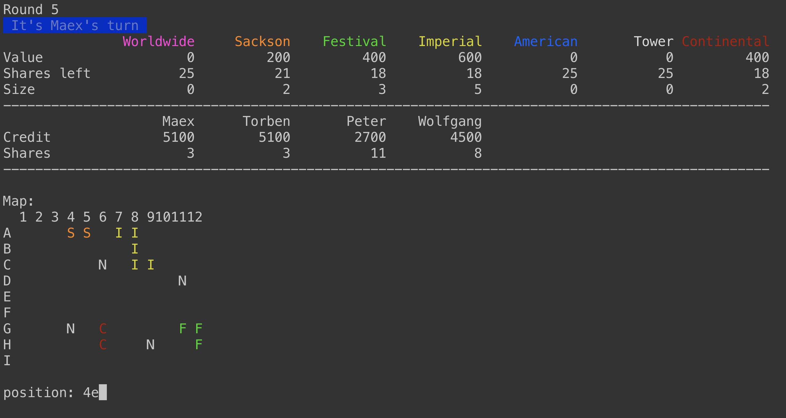

# Acquire Banker

A command line banker for the board game [Acquire](https://boardgamegeek.com/boardgame/5/acquire).



## About

[Acquire](https://boardgamegeek.com/boardgame/5/acquire) is a turn based stock-market simulation board game, for 2-6 players.  
Throughout the game, players must keep track of their own resources, as well as public game resources. Without a banking software this can easily become a tedious task that slows down the playing and fun.  
This repository hosts the sources of an interactive software that takes care of all counting, so the players can entirely enjoy their game.  

The following sections provide brief instructions on how to compile and use the software.

## Build & Run

### Requirements

 * While the banker-software is a Java program and as such compatible to any platform that supports a JDK, the output uses terminal color codes that are only correctly displayed on UNIX like systems.  
The client was specifically tested for **Mac OS**  and **Linux**.
 * JDK-11 or later is required.

### Instructions

There are two ways to power up the Banker:  

 * Direct launch:  
```bash
clean package spring-boot:run
# or
clean package spring-boot:run -Dspring-boot.run.arguments=/var/folders/q1/pcz3yx4x6j768w01jmm2py_h0000gn/T/acquire-1-3.json
```

 * Launch from a reusable self-contained JAR:  

```bash
mvn clean package
java -jar target/AcquireBanker.jar
```

Optionally you can pass a ```SAVEGAME``` as first runtime argument, to restore a previously saved game.

 > Note: ```SAVEGAME``` is the absolute file path of a previously automatically saved game in your ```TMPDIR```. Use ```echo $TMPDIR``` to locate the savegames.

### Phones

Phones can be used to access private player information at:
`http://127.0.0.1:8080/shares/{player}`

`player` is a number, starting at 0, incrementing by 1 for each player in order.
There is no access protection.

## Usage

The entire banker runs interaction / dialogue based.

 * When initializing a new game, provide the player amount as a number, e.g. ```3```. Then type the player names, separated by ```return```.
 * When asked for a company name / names, abbreviate them with the first letter.  
Examples:
   * Buying two *Sackson* and a *Festival* share: ```ssf```
   * Funding the *Continental* chain: ```c```
 * When asked for a position, provide a single word that encodes the coordinates.  
Example: 4-B is  provided as ```4b```

### Loading

 * Savegames are automatically placed in the OS tmpdir.  
    * On MacOS this is an application specific sandbox in ```/var/folders/...```.  
Find it with ```find /var/folders/*/*/*/acquire*```
 * To load a savegame, simply start the JAR with path to savegame as first argument.

## Contact / Pull Requests

 * Author: Maximilian Schiedermeier 
 * First release: June 2011
 * Github: Kartoffelquadrat
 * Webpage: https://www.cs.mcgill.ca/~mschie3
 * License: [MIT](https://opensource.org/licenses/MIT)
